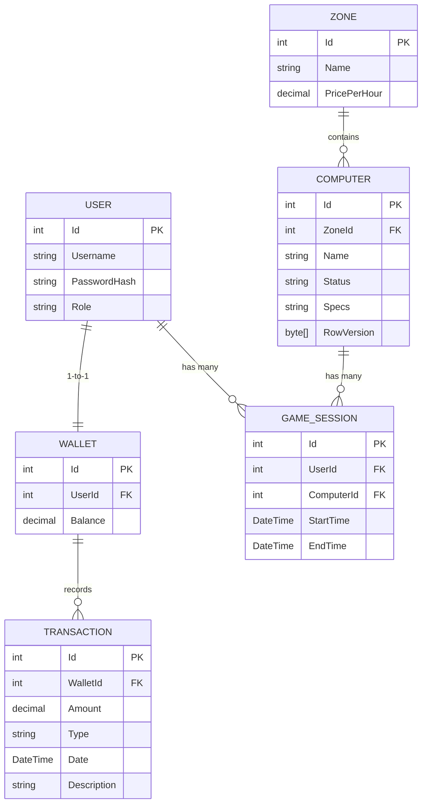

# CyberCafe Booking & Management API

Hệ thống backend quản lý giờ chơi và đặt máy trạm cho phòng máy (Cyber Cafe) được xây dựng trên nền tảng ASP.NET Core Web API 8, tuân thủ nghiêm ngặt các nguyên lý kiến trúc Clean Architecture (N-Tier Architecture).

---

## Tính năng hệ thống

* **Xác thực và Phân quyền JWT**: Quản lý truy cập dựa trên phân quyền giữa ba nhóm tài khoản chính: Admin (Quản trị viên), Staff (Nhân viên), và Customer (Khách hàng). Mật khẩu được mã hóa an toàn sử dụng thuật toán BCrypt.
* **Ví điện tử thành viên (Wallet)**: Cơ chế tự động thiết lập ví điện tử trống tương ứng với mỗi tài khoản khách hàng mới đăng ký.
* **Quản lý phòng máy (Zones & Computers)**: Cấu hình linh hoạt khu vực phòng máy (ví dụ: Standard, VIP) đi kèm với các biểu phí tính theo giờ khác nhau.
* **Phiên làm việc Kế hoạch chơi (StartSession)**:
  * Kiểm duyệt điều kiện số dư tối thiểu trong ví (tương đương tối thiểu một giờ chơi của máy mục tiêu).
  * Chuyển đổi trạng thái máy trạm sang trạng thái đang hoạt động (InUse).
  * Bảo đảm tính toàn vẹn và chống xung đột đặt máy đồng thời thông qua cơ chế EF Core Transactions và Optimistic Concurrency (RowVersion).
* **Kết thúc phiên làm việc (EndSession)**:
  * Cơ chế tính phí dịch vụ chính xác theo từng phút hoạt động thực tế nhằm đảm bảo tính công bằng tối đa cho khách hàng.
  * Tự động khấu trừ số dư ví thành viên theo chi phí phát sinh thực tế.
  * Ghi nhận lịch sử giao dịch chi tiết (Transactions) phục vụ mục đích kiểm toán.
  * Giải phóng máy trạm về trạng thái sẵn sàng sử dụng (Available).

---

## Kiến trúc dự án (Clean Architecture)

Hệ thống được chia thành bốn phân lớp độc lập nhằm tối ưu hóa khả năng kiểm thử, bảo trì và phát triển tính năng mới:

```
CyberCafe.sln
├── CyberCafe.Core           (Class Library) - Phân lớp Domain
│   ├── Entities/            - Định nghĩa các thực thể nghiệp vụ (User, Wallet, Computer, Session...)
│   ├── Enums/               - Các tập hợp định nghĩa trạng thái tĩnh (UserRole, ComputerStatus...)
│   ├── Interfaces/          - Thiết lập hợp đồng dịch vụ cốt lõi (IAuthService, IBookingService)
│   └── DTOs/                - Các đối tượng trung chuyển dữ liệu (Data Transfer Objects)
│
├── CyberCafe.Infrastructure (Class Library) - Phân lớp Infrastructure
│   └── Data/
│       ├── CyberCafeDbContext - Cấu hình Fluent API, ánh xạ quan hệ và hạt giống dữ liệu (Seed Data)
│       └── Migrations/      - Bản ghi lịch sử cấu trúc cơ sở dữ liệu
│
├── CyberCafe.Services       (Class Library) - Phân lớp Nghiệp vụ (Application Services)
│   ├── AuthService          - Logic xử lý đăng ký, đăng nhập và phát hành Token bảo mật
│   └── BookingService       - Logic điều khiển phiên chơi, tính cước chính xác và giao dịch an toàn
│
└── CyberCafe.API            (Web API Project) - Phân lớp Hiển thị (Presentation Layer)
    ├── Controllers/         - RESTful API Controllers
    ├── Properties/          - launchSettings.json (Cấu hình môi trường vận hành)
    └── Program.cs           - Điểm khởi chạy ứng dụng, cấu hình DI, JWT Auth và Swagger UI
```

---

## Sơ đồ Cơ sở Dữ liệu (Database Schema)

Dự án áp dụng mô hình Code-First với Entity Framework Core, hỗ trợ linh hoạt cả SQLite (phát triển nội bộ) và MySQL/MariaDB (vận hành thực tế).



---

## Hướng dẫn cài đặt và Vận hành

### Yêu cầu tiên quyết
* Hệ điều hành: Windows, Linux hoặc macOS.
* Môi trường phát triển: .NET SDK phiên bản 8.0 trở lên.

### Quy trình chạy cục bộ
1. **Sao chép kho lưu trữ**:
   ```bash
   git clone <link-github-cua-ban>
   cd InternetCafeBackend
   ```
2. **Khởi tạo dữ liệu và ứng dụng**:
   Khởi chạy kịch bản tự động trong PowerShell để khôi phục gói thư viện, thiết lập cấu trúc cơ sở dữ liệu SQLite cục bộ (`cybercafe.db`) và khởi động dịch vụ:
   ```powershell
   ./setup.ps1
   ```
3. **Môi trường Swagger UI**:
   Sau khi API khởi chạy thành công, giao diện kiểm thử Swagger UI sẵn sàng phục vụ tại địa chỉ mặc định:
   * **http://localhost:5000/swagger**

---

## Danh mục API Endpoints

### Dịch vụ Xác thực (Authentication)
* `POST /api/auth/register` - Đăng ký tài khoản mới (Mặc định Role: Customer)
* `POST /api/auth/login` - Thực hiện đăng nhập và trả về mã bảo mật JWT

### Quản lý Máy trạm và Khu vực (Computers & Zones)
* `GET /api/zones` - Truy xuất toàn bộ thông tin phòng máy và bảng giá giờ chơi
* `POST /api/zones` - Thiết lập khu vực phòng máy mới (Yêu cầu quyền: Admin)
* `GET /api/computers` - Liệt kê tất cả máy trạm cùng trạng thái hiện tại
* `POST /api/computers` - Đăng ký thêm máy trạm mới (Yêu cầu quyền: Admin)
* `PATCH /api/computers/{id}/status` - Cập nhật trạng thái máy trạm (Sẵn sàng, Bảo trì...) (Yêu cầu quyền: Admin, Staff)

### Điều khiển Phiên chơi (Booking Services)
* `POST /api/booking/start` - Khởi động phiên chơi máy trạm (Body JSON: `{ UserId, ComputerId }`)
* `POST /api/booking/end` - Đóng phiên chơi máy trạm và kết xuất hóa đơn (Body JSON: `{ UserId, ComputerId }`)

---

## Bản quyền và Giấy phép
Dự án được phân phối chính thức theo giấy phép MIT. Để biết thêm chi tiết, xin vui lòng tham khảo tệp `LICENSE` đính kèm.
